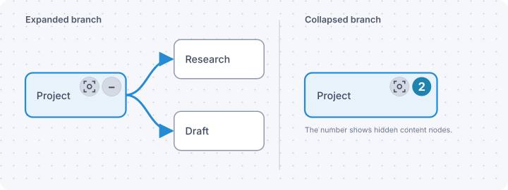
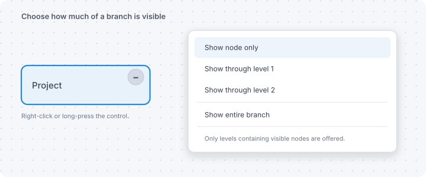
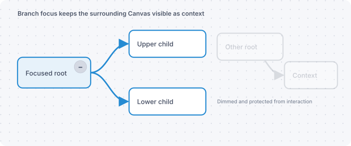
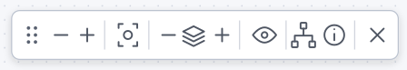

# Canvas Folding

Canvas Folding adds hierarchical folding, level views, and branch focus to the
standard Obsidian Canvas. It changes only the current view: nodes, edges,
content, positions, and the `.canvas` file itself remain untouched.

Requires Obsidian 1.13.0 or later. Canvas Folding works on desktop and mobile
and has no dependency on Advanced Canvas.

If Canvas Folding is useful to you, you can support its continued development
by buying me a coffee.

<a href="https://ko-fi.com/R5R2151DS7" target="_blank"></a>

## Features

- Collapse or expand one selected branch recursively.
- Collapse every rooted branch while keeping roots and isolated nodes visible.
- Show the complete Canvas through a chosen global level.
- Show one node, a limited number of levels, or an entire branch from a node
  control.
- Focus any content node or complete branch while dimming and protecting the
  remaining Canvas context.
- Use folding controls with hidden-node counts on parent nodes and focus
  controls on every content node, including leaves.
- Show or hide folding and focus controls independently without changing the
  current view state.
- Use a movable, responsive Canvas Folding toolbar.
- Keep state separately for each open Canvas tab.
- Optionally restore states between sessions without modifying Canvas files.
- React to node and edge changes, undo/redo, duplication, and Canvas re-renders.
- Handle multiple roots, multiple parents, shared descendants, cross-links,
  cycles, groups, text, file, image, and link nodes.
- Expose an optional versioned API for other plugins.

## Tested alongside Advanced Canvas

Canvas Folding does not require Advanced Canvas, but both plugins can remain
enabled and work alongside each other. Canvas Folding 1.0.0 completed an
extensive coexistence matrix with Advanced Canvas 6.5.4 and Obsidian 1.13.7 on
macOS, iPadOS, and iOS.

The tests covered plugin load order and restarts, node and edge editing,
different node types and shapes, nested groups, shared descendants, cycles,
focus, levels, persistence, multiple Canvas tabs, undo/redo, and desktop and
touch interaction. No unintended mutual interference was found in the
supported standard Canvas features: each plugin retains its own controls and
state, and using one plugin does not silently change the state owned by the
other. See [Using Canvas Folding with Advanced Canvas](#using-canvas-folding-with-advanced-canvas)
for the few details worth knowing when both plugins hide content.

## Visual guide

### Collapse and expand branches

The `−` control collapses the complete directed branch. Its replacement shows
the number of hidden content nodes and expands them again. The control grows
for two- or three-digit counts while the neighboring focus control stays
readable.



### Use the control tooltips

On desktop, pause the pointer over a folding control. Its tooltip states
whether the click will collapse or expand the branch, shows the relevant node
count, and points to the branch display menu.

The tooltip is especially useful with Advanced Canvas: if an Advanced Canvas
group currently hides descendants, it says how many are hidden there and
explains that Canvas Folding preserves the group's own collapsed state.

On touch devices, where hover is unavailable, long-press the control; an
Advanced Canvas notice with the hidden-descendant count appears at the top of
the branch display menu.

### Choose visible branch levels

Right-click or long-press a node control to show only the parent, reveal a
specific number of descendant levels, or show the entire branch.



### Focus a branch

Focus mode keeps the selected branch fully active while dimming and protecting
the surrounding Canvas. The wider context remains visible without distracting
from the branch being worked on.

Use the focus symbol on any content node to enter focus directly. Nodes without
children receive the same control, so they can be focused individually. Click
the active focus control again, or use the toolbar focus action, to exit.



## Quick start

1. [Install Canvas Folding](#installation), enable it, and open a Canvas.
2. Use directed edges from parent to child to define the hierarchy.
3. Click or tap a parent's `−` control to collapse its branch, or select the
   parent and use the Canvas Folding toolbar. Right-click or long-press the
   control to choose a visible branch level.
4. Optionally enable **Remember canvas states between sessions** to restore
   folding states after closing a tab or restarting Obsidian.

## How folding works

Canvas Folding interprets directed Canvas edges as hierarchy:
`fromNode` → `toNode`. A node can therefore have multiple parents, and the
Canvas is treated as a general directed graph rather than as a strict tree.
Traversal is deterministic and cycle-safe.

Global Canvas levels are measured from root nodes, meaning nodes without an
incoming edge. Level 0 contains the roots, level 1 their direct children, and
each following level the next generation of directed descendants. If a node is
reachable through multiple roots or paths, its shortest directed distance from
any root determines its level. A Canvas without a root has no global level
view, but its individual branch controls remain available.

Parent nodes receive a `−` folding control. When descendants are hidden, the
control displays the number of hidden non-group nodes:

- Click or tap the control to collapse or expand the complete branch.
- On desktop, hover over it to read its action, descendant count, and any
  additional Advanced Canvas collapsed-group information.
- Open its context menu to show only the node, show through a selected level,
  or show the entire branch.
- With shared descendants, a visible alternative parent can reveal the shared
  branch without revealing a hidden parent or its incident edge.

Every visible non-group node also receives a focus control. Folding controls
and focus controls can be hidden independently through the toolbar or command
palette. Hiding either kind of control changes only the interface: it does not
expand branches or end an active focus.

Hidden nodes also hide every incident edge, including edge labels. A non-empty
Canvas group is hidden when all non-group nodes geometrically contained by it
are hidden. Empty groups remain visible.

## Canvas toolbar

The optional toolbar provides the main Canvas Folding actions directly in the
Canvas. Drag its handle to move it, or focus the handle and use the arrow keys.
On narrow views and mobile devices, the toolbar can be scrolled horizontally.



The toolbar includes actions for:

- the selected branch: collapse and expand;
- the whole Canvas: collapse all rooted branches, select a global visible
  level, and expand all branches;
- showing or hiding folding controls;
- showing or hiding focus controls, followed by entering or exiting focus;
- inspecting the graph;
- showing the current state;
- hiding the toolbar itself.

Unavailable actions are disabled. The toolbar can always be shown, hidden,
toggled, or reset through the command palette.

## Commands

All commands are available from the command palette when their Canvas context
is valid:

| Command | Purpose |
| --- | --- |
| `Collapse selected branch` | Hide all directed descendants of the selected node. |
| `Expand selected branch` | Reveal the folded branch at the selected node. |
| `Focus selected branch` | Keep the selected node and descendants active while dimming the rest. |
| `Exit branch focus` | Remove focus without changing the underlying fold state. |
| `Collapse all branches` | Collapse every rooted branch. |
| `Show canvas through level…` | Set one visible depth for all rooted branches. |
| `Expand all branches` | Clear all folding and level restrictions. |
| `Show branch controls` | Display folding controls on parent nodes. |
| `Hide branch controls` | Hide folding controls in the current session without changing folded branches. |
| `Toggle branch controls` | Switch the branch controls between visible and hidden. |
| `Show focus controls` | Display focus controls on all visible content nodes, including leaves. |
| `Hide focus controls` | Hide focus controls without ending an active focus. |
| `Toggle focus controls` | Switch the focus controls between visible and hidden. |
| `Show canvas toolbar` | Display the Canvas Folding toolbar. |
| `Hide canvas toolbar` | Hide the Canvas Folding toolbar. |
| `Toggle canvas toolbar` | Switch the Canvas Folding toolbar between visible and hidden. |
| `Reset canvas toolbar position` | Return the toolbar to its default position. |
| `Inspect active canvas graph` | Report the recognized graph structure. |
| `Show current status` | Report visible-state counts, focus, controls, and persistence status. |

## Keyboard and touch

Node controls follow a depth-first Tab order. On a node, its focus control
comes before its folding control. Upper child branches are visited completely
before lower sibling branches. If exactly one node is selected, navigation
starts at that node's first available control.

- `Enter` or `Space` activates a node control or toolbar action.
- The keyboard context-menu key opens the branch-level menu from a folding
  control.
- Arrow keys move the focused toolbar handle.
- Keyboard focus remains on the invoked control after an action.

Touch targets are enlarged on coarse-pointer devices. The toolbar supports
horizontal touch scrolling and dragging. Canvas node selection remains native
on iPhone and iPad. Long-press access to the branch-level menu depends on
whether the installed Obsidian/WebView version emits a context-menu event.

## State and persistence

By default, fold state, level restrictions, temporary shared-branch reveals,
and branch focus are remembered only in the open Canvas tab. Navigating to
another file and back in that tab restores its state; closing the tab discards
it.

Enable **Remember canvas states between sessions** to also restore state in new
tabs and after restarting Obsidian or the plugin. The data is stored in Canvas
Folding's local `data.json`, never in the `.canvas` file. Entries for deleted or
renamed Canvas files and stale node IDs are cleaned automatically and can also
be reviewed or removed from the settings.

Canvas Folding does not synchronize settings or persisted states between
devices. They belong to the local Obsidian plugin configuration, so the same
Canvas can intentionally have different folding states on a Mac, iPhone, and
iPad. If Obsidian Sync or another synchronization system is configured to sync
plugin settings and data, it may also transfer Canvas Folding's `data.json`;
that behavior is controlled by the synchronization setup, not by Canvas
Folding.

## Installation

After Canvas Folding is listed, install it directly from Obsidian Community
Plugins.

Until then, or for a manual installation, download `main.js`, `manifest.json`,
and `styles.css` from a GitHub release and place them in:

```text
<vault>/.obsidian/plugins/canvas-folding/
```

Then reload Obsidian and enable **Canvas Folding** under Community plugins.

## Demo Canvas

The repository includes a documented demo covering a basic tree, a shared
descendant, a cycle, an isolated node, groups, and different node types:
[`examples/Canvas Folding Demo/`](examples/Canvas%20Folding%20Demo/README.md).

Copy the complete **Canvas Folding Demo** folder to the root of a vault and
open `Canvas Folding Demo/Canvas Folding Demo.canvas`. The explanatory cards
on the Canvas suggest actions and describe the expected result.

Focused regression fixtures and the full manual V1 test matrix remain
separately available under [`manual-tests/`](manual-tests/README.md).

## Settings

The settings page starts with a reminder that Canvas Folding never modifies
Canvas files.

- **Show canvas toolbar initially** controls the toolbar's state when the plugin
  loads. Commands can change it at any time.
- **Show branch controls initially** controls node buttons when the plugin
  loads. Commands can change them at any time.
- **Show focus controls initially** controls the focus symbols on all visible
  content nodes. Commands can change them at any time.
- **Background opacity during branch focus** controls how strongly unrelated
  Canvas content is dimmed.
- **Remember canvas states between sessions** enables persistent state.
- **Show status notices** enables action confirmations.
- **Manage persisted canvas states** lists saved Canvas paths and removes one or
  all cross-session states. Missing files and stale node references are cleaned
  when the manager opens; currently open tabs keep their session state.
- **Debug logging** writes diagnostic details to the developer console.

## Update Description

After an update with new user-facing features, Canvas Folding opens a
Markdown-rendered `What's new` view once. Closing it removes the view
completely; no release-note file is created in the Vault and it does not reopen
on every Obsidian start.

Use **Show last update** at the bottom of the plugin settings to open the
description again at any time. The repository keeps the same text in
[`Last Update.md`](Last%20Update.md).

## Privacy and data handling

Canvas Folding works entirely locally and sends no Canvas or vault data to
external services. The Ko-fi image in this README is documentation content and
is not loaded or contacted by the installed plugin.

When persistence is enabled, local plugin data contains vault-relative Canvas
paths, node IDs, and visibility settings. Canvas files themselves are never
modified by Canvas Folding.

## Compatibility and limitations

- Obsidian Canvas currently exposes only some extension points through public
  TypeScript APIs. Private runtime access is isolated in a compatibility layer
  and guarded defensively.
- Advanced Canvas portals and presentations are not part of this compatibility
  guarantee because those experimental features currently have upstream
  limitations of their own.
- Long-press context menus depend on the mobile platform and WebView behavior.
- Canvas Folding does not perform automatic layout, graph navigation, or branch
  styling.

### Using Canvas Folding with Advanced Canvas

Canvas Folding and Advanced Canvas can hide content independently. Canvas
Folding hides directed branches only in the current view and keeps its state in
the open tab or, optionally, in Canvas Folding's `data.json`. Advanced Canvas'
collapsible groups have their own controls and store their group state in the
Canvas data.

When both mechanisms are used, check which control owns the hidden content:

- A numbered Canvas Folding control means that Folding currently hides that
  many content nodes below the branch.
- A Canvas Folding `−` can remain visible while an Advanced Canvas group hides
  descendants inside it; the control's tooltip explains this case.
- On touch devices, long-press that control to see an Advanced Canvas notice
  with the hidden-descendant count at the top of the branch display menu.
- Expanding one mechanism does not automatically expand the other.

After enabling or disabling Advanced Canvas while one of its groups is
collapsed, close and reopen the Canvas before continuing to edit. The already
open view can temporarily retain Advanced Canvas group controls or show an
empty group frame. Reopening rebuilds the Canvas view from the stored data.

## Public API

Other plugins can optionally discover Canvas Folding by the stable plugin ID
`canvas-folding`. The read-only `CanvasFoldingApi` v1 returns effective hidden
node and edge IDs for a vault-relative Canvas path. It exposes no DOM elements,
Canvas views, workspace leaves, or internal state classes.

See [`docs/api.md`](docs/api.md) for the complete contract and a defensive
discovery example. Consumers must remain functional when Canvas Folding is not
installed, disabled, or exposes an incompatible API version.

## Development

Requires Node.js 20.19 or later.

```bash
npm ci
npm test
npm run build:prod
```

For local deployment, set `OBSIDIAN_PLUGINS_DIR` to a test vault's plugin
directory:

```bash
OBSIDIAN_PLUGINS_DIR="/path/to/vault/.obsidian/plugins" npm run build:prod:deploy
```

The production release contains `main.js`, `manifest.json`, and `styles.css`.
See [`CONTRIBUTING.md`](CONTRIBUTING.md) and
[`docs/release-checklist.md`](docs/release-checklist.md) for development and
release checks.

## Support and feedback

Please report reproducible problems and feature requests through the
[GitHub issue tracker](https://github.com/HKohlhoff/canvas-folding/issues).

## License

Canvas Folding is licensed under the
[GNU General Public License v3.0 or later](LICENSE).
